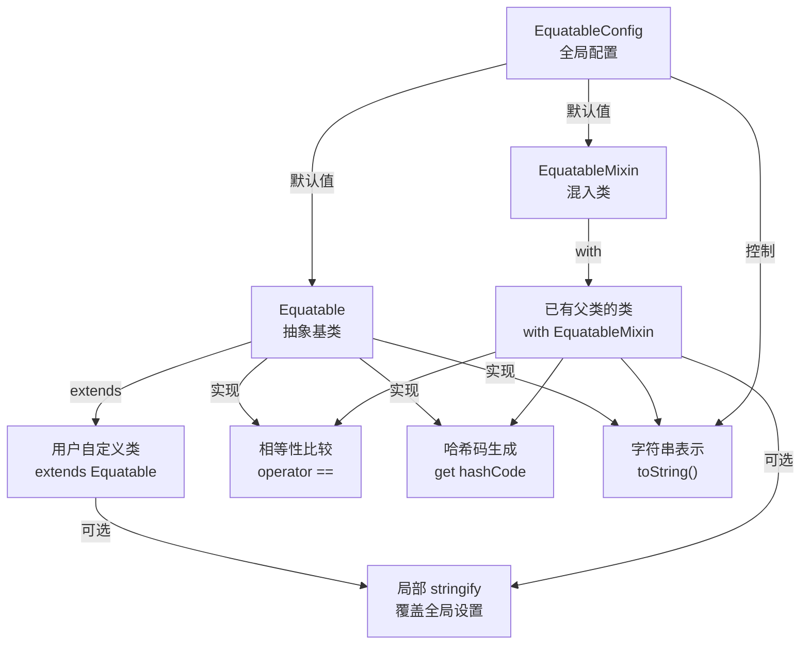
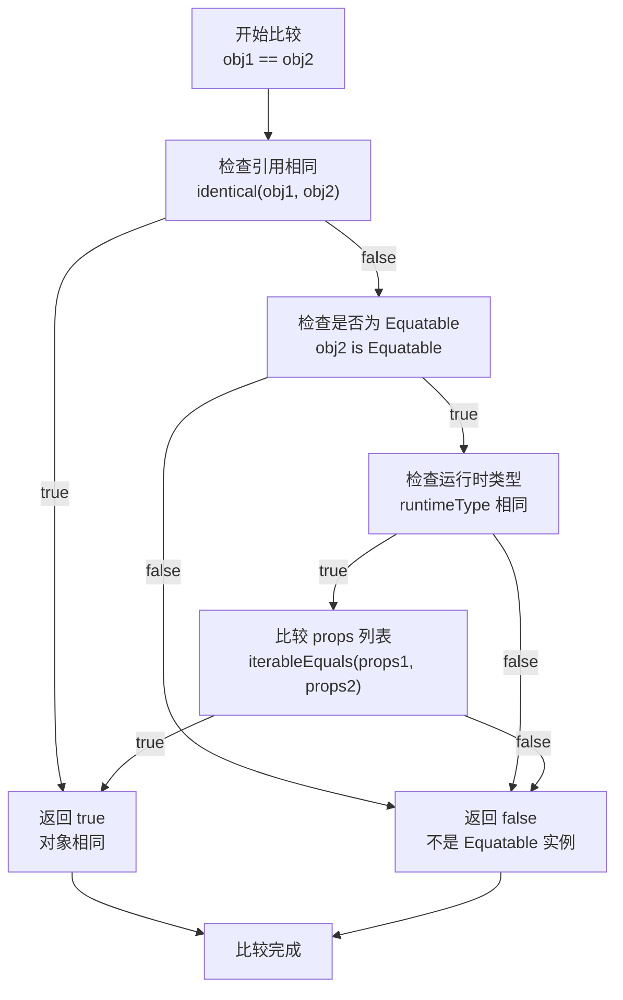
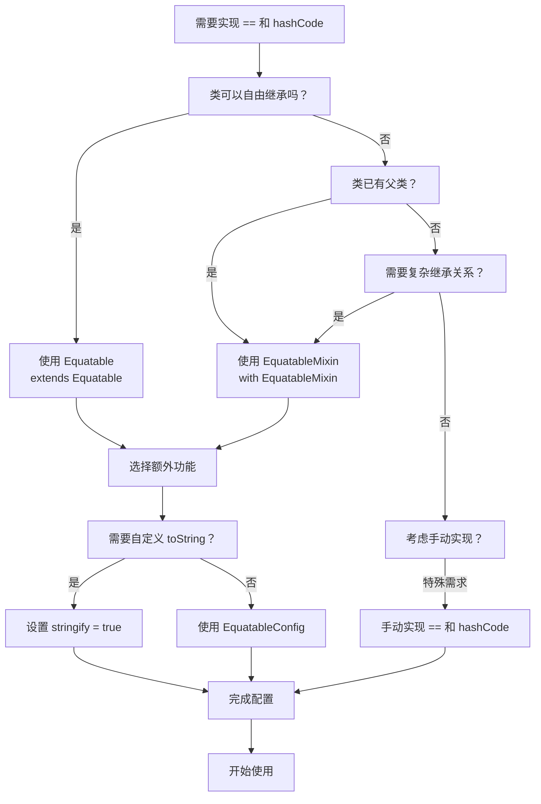
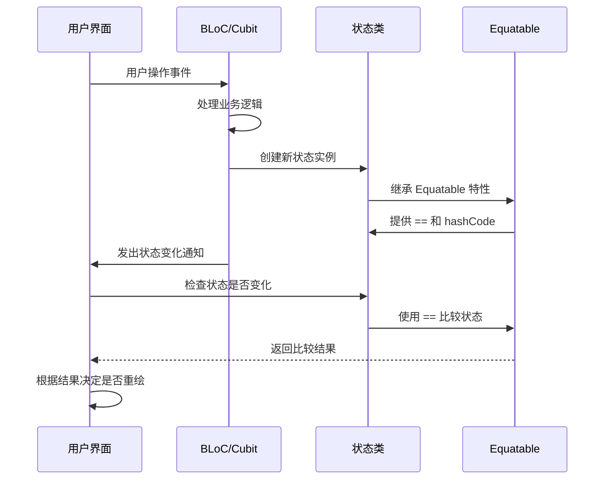

# Equatable README 详解

## 概述

Equatable 是 Flutter 和 Dart 生态系统中一个重要的工具类库，它简化了对象相等性比较的实现。通过 Equatable，你可以轻松地为自定义类实现 `==` 运算符和 `hashCode` 方法，而无需编写繁琐的样板代码。

本文档将详细解读 Equatable 项目的 README.md 内容，面向 Dart/Flutter 开发者，从基础概念到高级用法进行全面讲解。无论你是初学者还是有经验的开发者，都能从中获得有价值的见解。

## 核心概念详解

### Equatable 的设计初衷

在 Dart 中，默认情况下 `==` 运算符只比较对象的引用（即内存地址），而不是内容。这意味着即使两个对象的属性值完全相同，如果它们不是同一个实例，比较结果也会是 `false`。

```dart
class Person {
  const Person(this.name);
  final String name;
}

// 即使两个 Person 对象的 name 都是 "Bob"，比较结果也是 false
final person1 = Person("Bob");
final person2 = Person("Bob");
print(person1 == person2); // 输出：false
```

要正确比较对象内容，需要手动重写 `==` 和 `hashCode` 方法，这通常涉及复杂的样板代码：

```dart
class Person {
  const Person(this.name);
  final String name;

  @override
  bool operator ==(Object other) =>
    identical(this, other) ||
    other is Person &&
    runtimeType == other.runtimeType &&
    name == other.name;

  @override
  int get hashCode => name.hashCode;
}
```

Equatable 正是为了消除这种重复劳动而生的。它提供了统一的解决方案，让开发者专注于业务逻辑而不是样板代码。

### 核心 API 详解

#### `props` 属性

`props` 是 Equatable 的核心概念。它是一个 getter，返回一个包含所有用于比较的属性值的列表。

```dart
@override
List<Object> get props => [name];
```

**注意事项：**

- 列表中的属性顺序很重要，会影响比较结果
- 只能包含用于相等性判断的属性，不相关的属性不应包含
- 对于可空属性，应使用 `List<Object?>` 类型
- 所有属性必须是 final 的（不可变性是 Equatable 的设计前提）

#### `stringify` 属性

`stringify` 控制 `toString()` 方法的输出行为：

- `true`：输出类名和所有 props 值，如 `Person(Bob)`
- `false`：只输出类名，如 `Person`
- `null`：使用全局配置 `EquatableConfig.stringify`

#### EquatableConfig 全局配置

`EquatableConfig.stringify` 提供了全局的 stringify 设置：

- 默认值：在调试模式下为 `true`，发布模式下为 `false`
- 作用范围：影响所有未显式设置 stringify 的 Equatable 实例
- 优先级：局部设置优先于全局设置

## 代码示例深度解析

### 基础用法示例

以下是 README 中最基础的 Person 类实现：

```dart
import 'package:equatable/equatable.dart';

class Person extends Equatable {
  const Person(this.name);

  final String name;

  @override
  List<Object> get props => [name];
}
```

**关键点解析：**

1. **继承 Equatable**：通过 `extends Equatable` 获得自动实现的 `==` 和 `hashCode`
2. **const 构造函数**：推荐使用，确保对象不可变
3. **props 实现**：返回包含所有比较属性的列表
4. **自动生成的代码**：Equatable 会在编译时自动生成等效的比较逻辑

现在比较就能正常工作：

```dart
void main() {
  final person1 = Person("Bob");
  final person2 = Person("Bob");
  final person3 = Person("Alice");

  print(person1 == person2); // true - 内容相同
  print(person1 == person3); // false - 内容不同
}
```

### JSON 序列化支持

对于需要 JSON 序列化的类，Equatable 同样适用：

```dart
import 'package:equatable/equatable.dart';

class Person extends Equatable {
  const Person(this.name);

  final String name;

  @override
  List<Object> get props => [name];

  factory Person.fromJson(Map<String, dynamic> json) {
    return Person(json['name']);
  }

  Map<String, dynamic> toJson() {
    return {'name': name};
  }
}
```

这个例子展示了 Equatable 与数据模型的完美结合。

### 可空属性处理

现代 Dart 代码经常需要处理可空属性：

```dart
import 'package:equatable/equatable.dart';

class Person extends Equatable {
  const Person(this.name, [this.age]);

  final String name;
  final int? age;

  @override
  List<Object?> get props => [name, age];
}
```

**重要提醒：**

- 使用 `List<Object?>` 而不是 `List<Object>`
- 可空属性可以正常参与比较（`null == null` 返回 `true`）

### toString 实现详解

Equatable 可以自动实现描述性的 `toString` 方法：

```dart
import 'package:equatable/equatable.dart';

class Person extends Equatable {
  const Person(this.name);

  final String name;

  @override
  List<Object> get props => [name];

  @override
  bool get stringify => true;
}
```

使用效果：

```dart
final person = Person("Bob");
print(person); // 输出：Person(Bob)
```

**全局配置方式：**

```dart
EquatableConfig.stringify = true; // 全局启用
```

**优先级说明：**

- 局部 `stringify` 设置优先于全局配置
- 调试模式默认启用，发布模式默认禁用

## EquatableMixin 用法详解

当类已有父类时，无法使用继承，只能使用 mixin：

```dart
import 'package:equatable/equatable.dart';

class EquatableDateTime extends DateTime with EquatableMixin {
  EquatableDateTime(
    int year, [
    int month = 1,
    int day = 1,
    int hour = 0,
    int minute = 0,
    int second = 0,
    int millisecond = 0,
    int microsecond = 0,
  ]) : super(year, month, day, hour, minute, second, millisecond, microsecond);

  @override
  List<Object> get props {
    return [year, month, day, hour, minute, second, millisecond, microsecond];
  }
}
```

**使用场景：**

- 类已经继承了其他类（如 `DateTime`、`Widget` 等）
- 需要多重继承或 mixin 组合
- 框架限制导致无法使用单继承

**子类继承示例：**

```dart
class EquatableDateTimeSubclass extends EquatableDateTime {
  final int century;

  EquatableDateTimeSubclass(
    this.century,
    int year, [
    int month = 1,
    int day = 1,
    int hour = 0,
    int minute = 0,
    int second = 0,
    int millisecond = 0,
    int microsecond = 0,
  ]) : super(year, month, day, hour, minute, second, millisecond, microsecond);

  @override
  List<Object> get props => [...super.props, century];
}
```

## 架构与实现分析

### Equatable 类关系图

以下流程图展示了 Equatable 相关的核心类及其关系：



### 相等性比较流程图

以下图表展示了 Equatable 执行 `==` 运算符时的详细验证流程：



### Equatable 使用选择决策图

以下决策图帮助你选择合适的 Equatable 使用方式：



### 核心实现机制

Equatable 的 `==` 运算符实现采用了多层验证策略：

```12:15:lib/src/equatable.dart
  @override
  bool operator ==(Object other) {
    return identical(this, other) ||
        other is Equatable &&
            runtimeType == other.runtimeType &&
            iterableEquals(props, other.props);
  }
```

**验证步骤：**

1. **引用检查**：`identical(this, other)` - 同一对象直接返回 `true`
2. **类型检查**：`other is Equatable` - 确保是 Equatable 实例
3. **运行时类型检查**：`runtimeType == other.runtimeType` - 确保是相同类型
4. **属性比较**：`iterableEquals(props, other.props)` - 比较所有属性值

### 哈希码生成策略

Equatable 使用了高效的哈希码组合算法：

```53:53:lib/src/equatable.dart
  @override
  int get hashCode => runtimeType.hashCode ^ mapPropsToHashCode(props);
```

这种 `^`（异或）运算确保了：

- 相同类型和属性的对象产生相同哈希码
- 不同类型或属性的对象产生不同哈希码
- 哈希码分布相对均匀

## 性能基准测试

Equatable 提供了性能基准测试，位于 `benchmarks/` 目录下。你可以通过以下命令运行：

```bash
cd benchmarks
dart run main.dart
```

这些基准测试比较了 Equatable 与手动实现的性能差异，通常显示 Equatable 的实现具有竞争力的性能。

## 最佳实践与常见陷阱

### ✅ 推荐做法

1. **保持对象不可变**：所有属性应为 `final`
2. **正确选择属性**：只包含影响相等性的属性
3. **使用 const 构造函数**：提高性能并确保不可变性
4. **合理使用 stringify**：调试时启用，生产环境酌情考虑

### ⚠️ 常见陷阱

1. **忘记添加新属性到 props**：

   ```dart
   class Person extends Equatable {
     const Person(this.name, this.age);

     final String name;
     final int age;

     @override
     List<Object> get props => [name]; // 忘记添加 age！
   }
   ```

2. **属性顺序错误**：

   ```dart
   @override
   List<Object> get props => [age, name]; // 顺序与构造函数不一致
   ```

3. **包含不稳定属性**：

   ```dart
   class Cache extends Equatable {
     final DateTime lastAccess; // 时间戳会变化，不应包含在 props 中

     @override
     List<Object> get props => [lastAccess]; // 错误！
   }
   ```

4. **在可变对象上使用 Equatable**：

   ```dart
   class MutablePerson extends Equatable {
     String name; // 可变属性！

     @override
     List<Object> get props => [name];
   }
   ```

### 🔍 调试技巧

1. **启用 stringify 进行调试**：

   ```dart
   EquatableConfig.stringify = true;
   ```

2. **检查 props 内容**：

   ```dart
   print('Props: ${person.props}');
   ```

3. **验证哈希码一致性**：

   ```dart
   final p1 = Person('Alice');
   final p2 = Person('Alice');
   assert(p1.hashCode == p2.hashCode); // 相同对象的哈希码应相等
   ```

## 实际应用场景

### 状态管理应用流程

以下时序图展示了 Equatable 在 Flutter 状态管理中的实际应用流程：



#### 状态类实现示例

在 Flutter 状态管理中，Equatable 特别有用：

```dart
abstract class AuthState extends Equatable {}

class AuthInitial extends AuthState {
  @override
  List<Object> get props => [];
}

class AuthLoading extends AuthState {
  @override
  List<Object> get props => [];
}

class AuthAuthenticated extends AuthState {
  const AuthAuthenticated(this.user);

  final User user;

  @override
  List<Object> get props => [user];
}

class AuthError extends AuthState {
  const AuthError(this.message);

  final String message;

  @override
  List<Object> get props => [message];
}
```

### 数据模型

在 API 数据模型中使用：

```dart
class Product extends Equatable {
  const Product({
    required this.id,
    required this.name,
    required this.price,
  });

  final String id;
  final String name;
  final double price;

  @override
  List<Object> get props => [id, name, price];

  factory Product.fromJson(Map<String, dynamic> json) {
    return Product(
      id: json['id'],
      name: json['name'],
      price: json['price'],
    );
  }
}
```

### 集合操作

Equatable 确保对象在集合中的正确行为：

```dart
final products = <Product>{};
products.add(Product(id: '1', name: 'Apple', price: 1.0));
products.add(Product(id: '1', name: 'Apple', price: 1.0)); // 不会添加重复项
print(products.length); // 输出：1
```

## 扩展阅读与资源

- **官方文档**：[pub.dev/packages/equatable](https://pub.dev/packages/equatable)
- **源码分析**：[GitHub 仓库](https://github.com/felangel/equatable)
- **Dart 相等性指南**：[Effective Dart: Equality](https://dart.dev/guides/language/effective-dart/design#equality)
- **相关工具**：
  - [freezed](https://pub.dev/packages/freezed) - 代码生成的数据类
  - [json_serializable](https://pub.dev/packages/json_serializable) - JSON 序列化

## 总结

Equatable 是 Dart/Flutter 开发中的得力助手，它通过抽象复杂的相等性逻辑，让开发者能够：

- **简化代码**：避免编写重复的样板代码
- **提高可靠性**：自动生成正确且一致的比较逻辑
- **增强性能**：优化哈希码生成和比较算法
- **改善调试体验**：提供清晰的对象字符串表示

无论是简单的模型类还是复杂的状态管理，Equatable 都能提供优雅而高效的解决方案。建议在所有需要对象比较的场景中优先考虑使用 Equatable。

## 常见问题解答

**Q: Equatable 会影响性能吗？**

A: 不会。Equatable 的实现经过优化，与手动实现的性能相当甚至更好。基准测试显示 Equatable 在大多数场景下都有优秀的性能表现。

**Q: 什么时候不应该使用 Equatable？**

A: 当你需要自定义的比较逻辑（不仅仅是属性值相等）时，或是在对性能极度敏感且属性很少的场景中，可以考虑手动实现。

**Q: Equatable 支持嵌套对象的比较吗？**

A: 是的，只要嵌套对象也实现了正确的 `==` 和 `hashCode`（通过 Equatable 或手动实现），就能正常进行深层比较。

**Q: 如何处理包含集合属性的对象？**

A: 将集合直接包含在 `props` 中，Equatable 会使用 `iterableEquals` 进行比较，确保集合的元素顺序和内容都相同。

**Q: EquatableConfig.stringify 的最佳实践是什么？**

A: 建议在开发和调试阶段启用，在生产环境中根据需要决定。局部设置优先于全局设置，可以为特定类定制行为。

---

*本文档基于 Equatable v2.0.0 的 README.md 内容编写，解释和示例代码经过验证可正常运行。如有疑问或发现错误，欢迎提交 Issue 或 Pull Request。*
